# SOC Analyst Splunk Operations Workbook

Splunk SOC operations workbook covering SPL triage, log ingestion, reports, dashboards, alert-candidate logic, parsing, masking, field extraction, indexed fields, and applied network-log analysis.

This repository is a reviewer-facing proof artifact for SOC, MDR, SIEM, detection analyst, and security operations roles. It demonstrates practical Splunk analyst workflows across search, ingestion, dashboarding, parsing configuration, and investigation validation.

This README is the primary review path. It presents the work as a visual evidence narrative first, then links each section to the full technical references.

This walkthrough shows the SOC Analyst Splunk Operations Workbook as a visual investigation story. The goal is to make the evidence readable to a reviewer who may not want to inspect every SPL query or configuration file first.

The full technical details are available in the section guides, SPL files, and Splunk configuration files. This page highlights the most reviewer-friendly proof.

## 1. SPL Triage Starts With Searchable Evidence

A Splunk analyst first needs to prove that the dataset is searchable, then narrow the view using fields, time windows, filters, tables, enrichment, and baseline logic.

The workbook begins with foundational SPL triage and progresses into anomaly-style reasoning.

This search uses per-user country frequency to identify unusual VPN login geography. The point is not just to count events, but to compare activity against the user baseline.

The z-score search extends that idea by looking for unusual login timing. This shows the transition from basic SPL to analyst logic that can support investigation.

Supporting files:

- [Section 01 guide](docs/01-spl-fundamentals-and-detection-queries.md)
- [Section 01 SPL](spl/01-spl-fundamentals.spl)

## 2. Log Ingestion Must Be Proven Before Analysis

Before reports or detections matter, the analyst has to prove that Splunk is receiving the right data with the right metadata.

This workbook validates service status, receiving configuration, forwarder flow, index creation, monitored inputs, and searchable log ingestion.

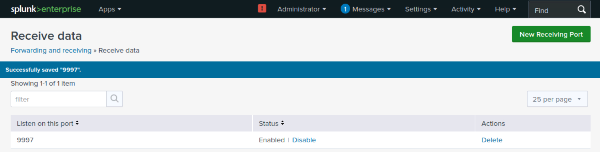

Splunk receiving on port `9997` is the foundation for forwarding data into the indexer.

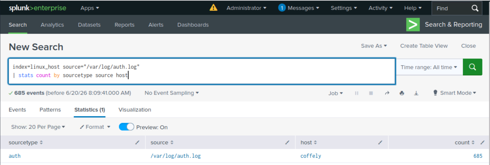

The auth log validation proves that Linux authentication data is searchable with useful source, sourcetype, host, and index context.

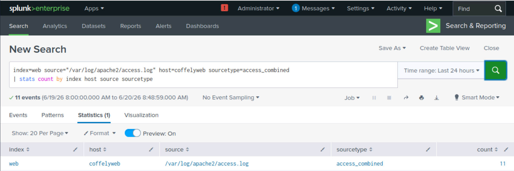

The web log validation proves that Apache access logs were onboarded and can support URI, source, status, and web activity review.

Supporting files:

- [Section 02 guide](docs/02-splunk-lab-deployment-and-log-ingestion.md)
- [Section 02 SPL](spl/02-ingestion-validation.spl)

## 3. Recurring Review Becomes Reports, Alert Logic, and Dashboards

Once data is searchable, repeated questions should become reusable Splunk assets. This section shows reports, alert-candidate logic, and dashboard panels.

This search focuses on external source IPs accessing a restricted URI. It demonstrates alert-candidate logic without overstating production alert deployment.

The dashboard evidence shows how raw search results can be turned into a recurring review surface for source IP, URI, and status-code activity.

Supporting files:

- [Section 03 guide](docs/03-reports-alerts-and-dashboards.md)
- [Section 03 SPL](spl/03-reports-alerts-dashboards.spl)

## 4. Broken Parsing Is Repaired With Splunk Configuration

This is the strongest technical section of the workbook. It shows that the artifact is not only search usage. It includes Splunk parsing mechanics: `inputs.conf`, `props.conf`, `transforms.conf`, `fields.conf`, event boundaries, multiline handling, masking, and field extraction.

First, the workbook captures broken event boundaries.

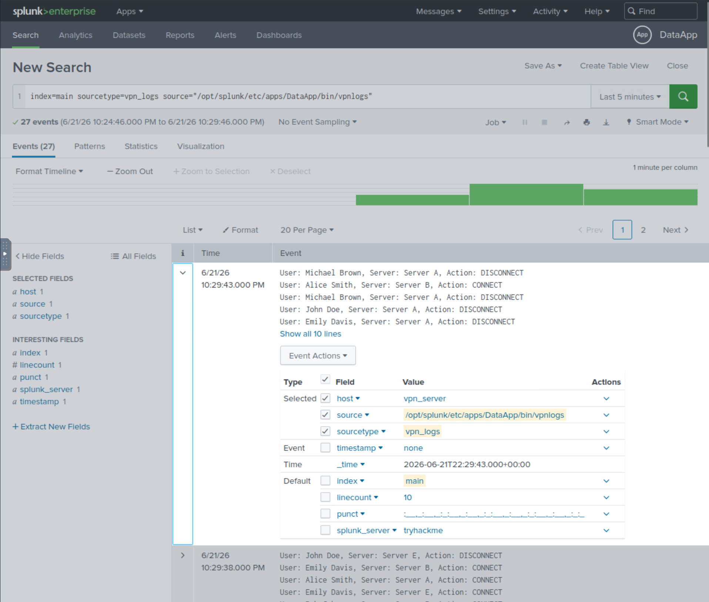

Then it shows the repair using `props.conf`.

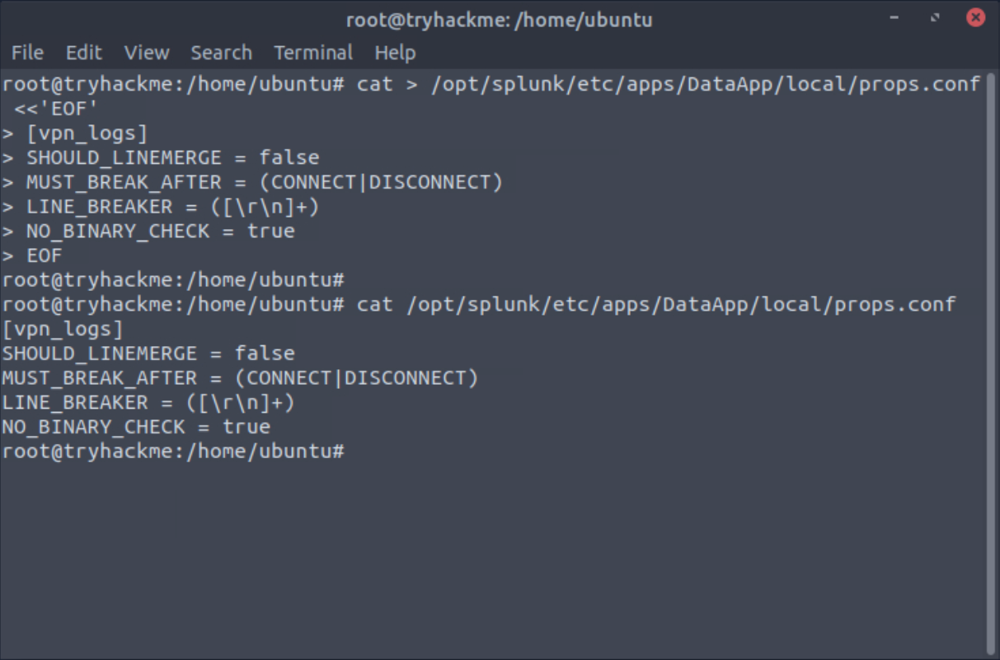

The repaired result is validated in Splunk search.

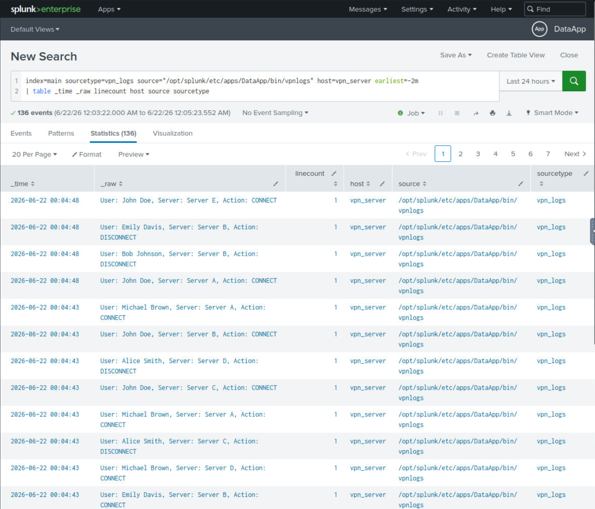

The workbook also demonstrates masking of credit-card-like values before publishing evidence.

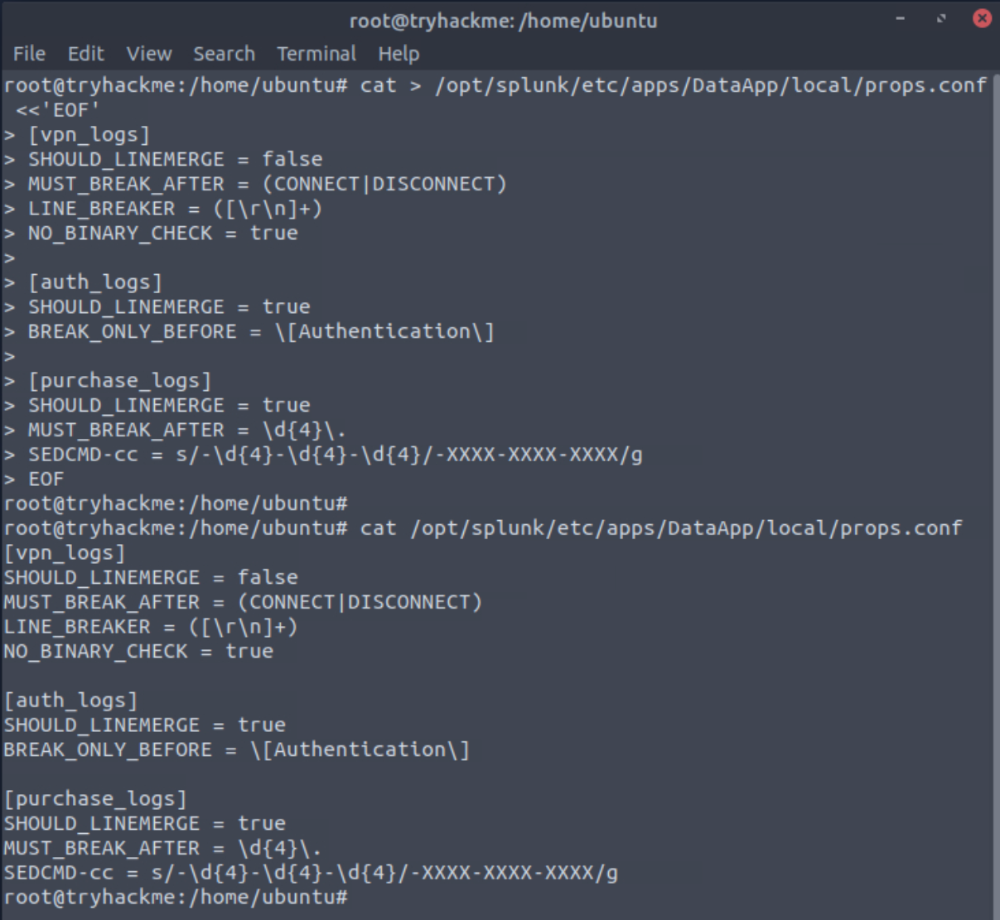

The masked result is then validated.

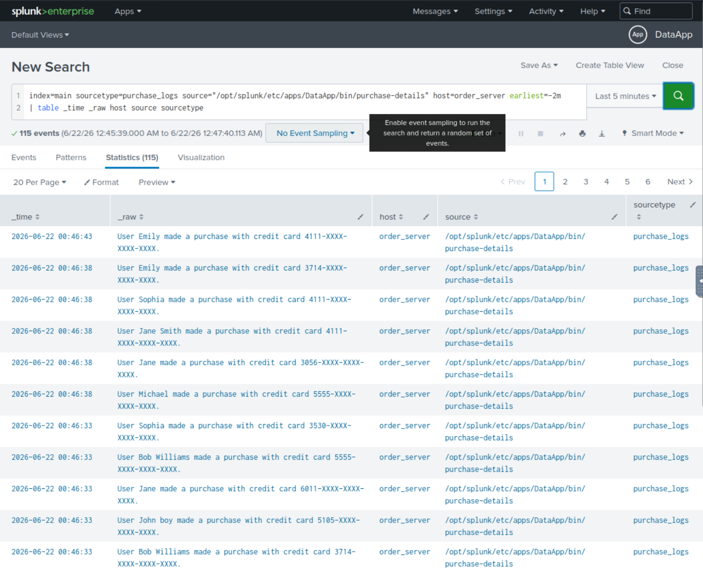

Finally, custom fields are extracted and shown as searchable analyst fields.

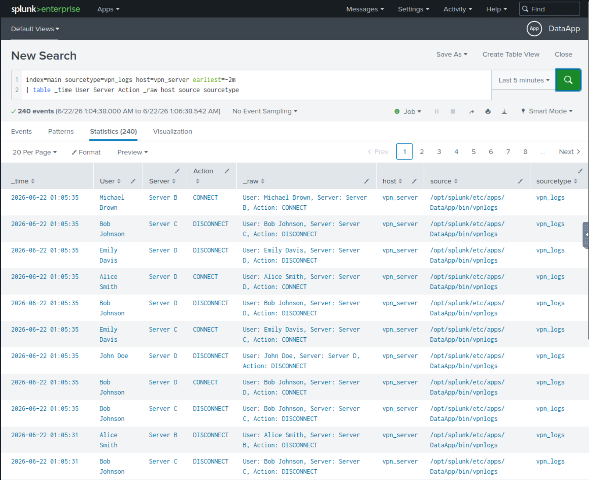

Supporting files:

- [Section 04 guide](docs/04-data-parsing-normalization-and-field-extraction.md)
- [DataApp inputs.conf](configs/dataapp/inputs.conf)
- [DataApp props.conf](configs/dataapp/props.conf)
- [DataApp transforms.conf](configs/dataapp/transforms.conf)
- [DataApp fields.conf](configs/dataapp/fields.conf)
- [Section 04 SPL](spl/04-data-manipulation-validation.spl)

## 5. Repaired Network Logs Become Analyst-Ready Results

The final section applies the parsing workflow to broken network-log data. The result is a structured dataset that can answer investigation questions about users, departments, domains, URIs, source IPs, countries, and sensitive-looking document access.

The initial evidence shows broken network events.

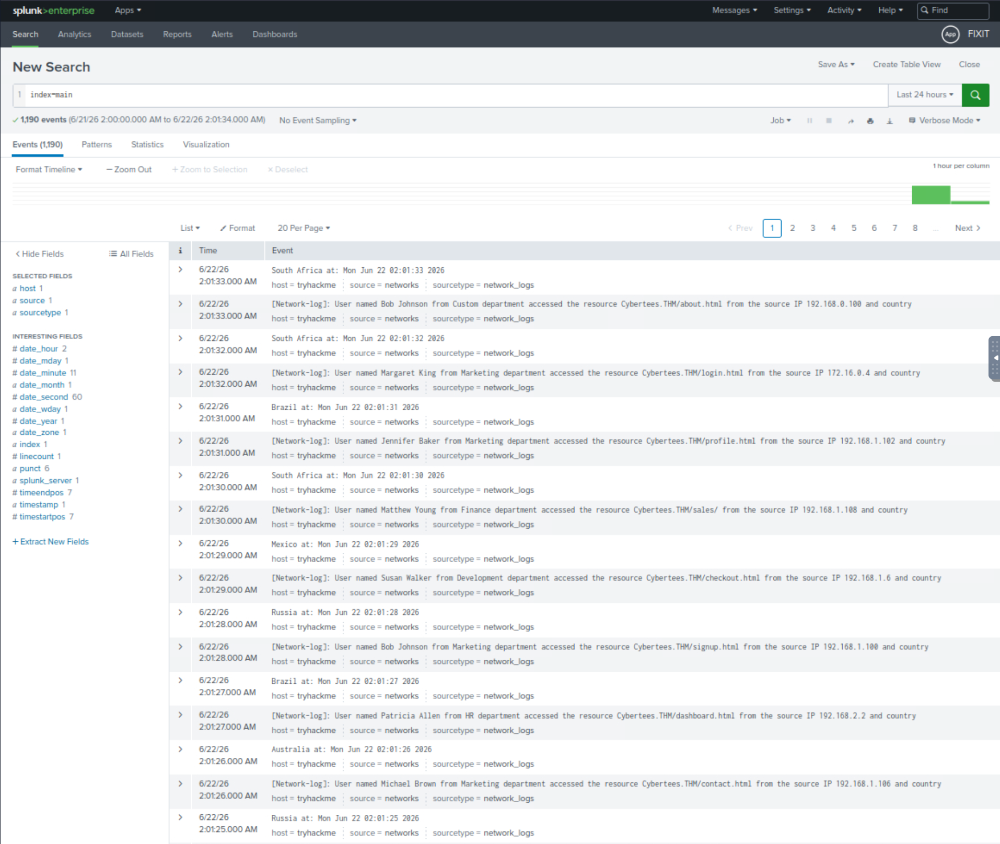

The parsing repair is then expressed through Splunk configuration.

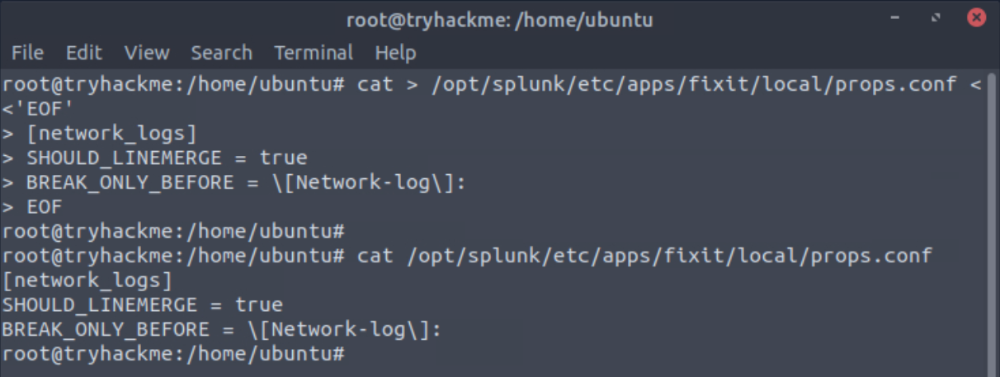

Custom fields are extracted from the network logs.

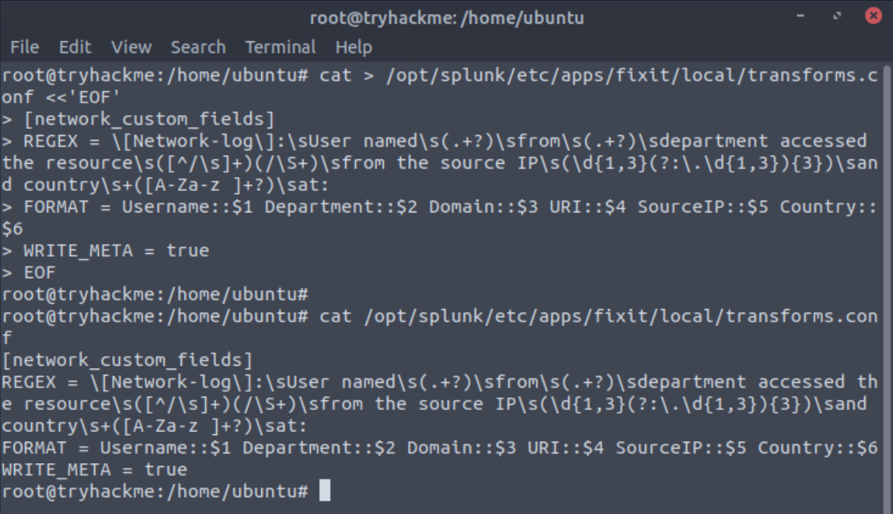

The corrected field extraction is validated in Splunk.

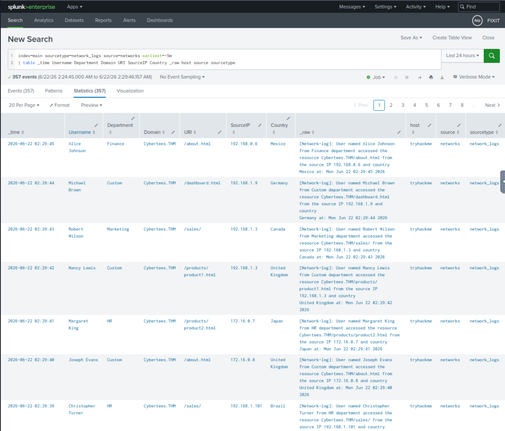

The final result is an analyst-ready network activity summary.

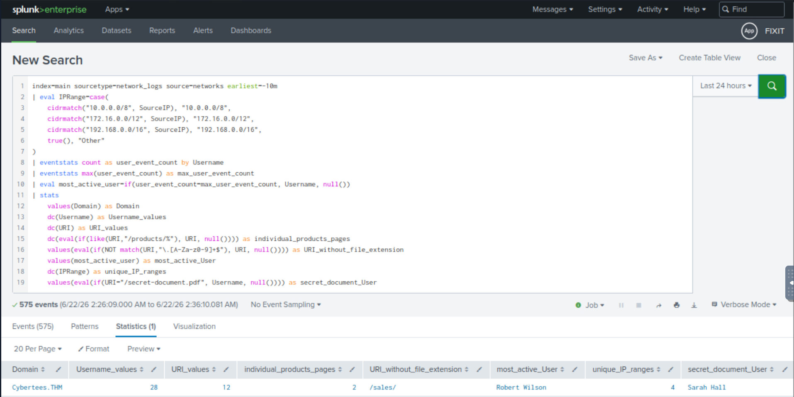

Supporting files:

- [Section 05 guide](docs/05-applied-parsing-fix-and-network-log-analysis.md)
- [Fixit inputs.conf](configs/fixit/inputs.conf)
- [Fixit props.conf](configs/fixit/props.conf)
- [Fixit transforms.conf](configs/fixit/transforms.conf)
- [Fixit fields.conf](configs/fixit/fields.conf)
- [Section 05 SPL](spl/05-fixit-analysis.spl)

## Reviewer Takeaway

This workbook demonstrates more than isolated searches. It shows a complete Splunk analyst progression:

1. Search and triage data.
2. Validate ingestion.
3. Build reusable reports and dashboard panels.
4. Diagnose broken parsing.
5. Repair event structure.
6. Mask sensitive values.
7. Extract analyst-useful fields.
8. Validate fields with SPL.
9. Use repaired data for network-log analysis.

## Reference Hubs

| Reviewer path | Link |
|---|---|
| Reviewer proof map | [Reviewer Proof Map](reviewer-proof-map.md) |
| Section guide index | [docs/](docs/) |
| SPL searches | [spl/](spl/) |
| Splunk configuration files | [configs/](configs/) |
| Screenshot evidence archive | [screenshots/](screenshots/) |

## Full Reference Index

| Area | Guide | Technical files | Screenshot evidence |
|---|---|---|---|
| SPL triage and anomaly logic | [Section 01](docs/01-spl-fundamentals-and-detection-queries.md) | [01-spl-fundamentals.spl](spl/01-spl-fundamentals.spl) | [Screenshots 01-17](screenshots/01-splunk-exploring-spl/) |
| Splunk deployment and ingestion | [Section 02](docs/02-splunk-lab-deployment-and-log-ingestion.md) | [02-ingestion-validation.spl](spl/02-ingestion-validation.spl) | [Screenshots 18-33](screenshots/02-splunk-setting-up-soc-lab/) |
| Reports, alerts, dashboards | [Section 03](docs/03-reports-alerts-and-dashboards.md) | [03-reports-alerts-dashboards.spl](spl/03-reports-alerts-dashboards.spl) | [Screenshots 34-42](screenshots/03-splunk-dashboards-and-reports/) |
| Parsing, masking, field extraction | [Section 04](docs/04-data-parsing-normalization-and-field-extraction.md) | [DataApp configs](configs/dataapp/), [04 SPL validation](spl/04-data-manipulation-validation.spl) | [Screenshots 43-67](screenshots/04-splunk-data-manipulation/) |
| Applied network-log repair | [Section 05](docs/05-applied-parsing-fix-and-network-log-analysis.md) | [Fixit configs](configs/fixit/), [05 SPL analysis](spl/05-fixit-analysis.spl) | [Screenshots 68-75](screenshots/05-splunk-fixit-challenge/) |

## Public Safety and Scope

This is a public portfolio artifact built from authorized lab work. It is designed to demonstrate analyst reasoning, Splunk configuration literacy, validation searches, and evidence documentation.

The artifact does not claim production Splunk administration, enterprise SIEM ownership, or professional incident response authority. It shows practical analyst workflows that map to SOC and MDR work.

Sensitive values are avoided or redacted. The repository focuses on detection logic, parsing mechanics, validation steps, and analyst-ready documentation.

## Portfolio Role

This is a Tier 2 supporting SOC/SIEM operations artifact.

It supports the main portfolio pillars:

1. Elastic SIEM Detection Engineering and Vulnerability Risk Automation
2. Azure Cloud Security Governance
3. Empire Breacher AI Security Research Harness

This workbook adds Splunk-specific proof for roles that mention Splunk, SIEM operations, SOC triage, log ingestion, dashboarding, reporting, parsing, and field extraction.
