# Section 01 - SPL Fundamentals and Detection Queries

Previous | [README](../README.md) | [Proof Map](../reviewer-proof-map.md) | [Docs Index](README.md) | [Next](./02-splunk-lab-deployment-and-log-ingestion.md)

## Purpose

This section documents the SPL investigation foundation used throughout the workbook.

The goal is to show practical search progression: validate searchable data, filter event sets, shape results into analyst-readable tables, enrich events, and build simple anomaly logic.

## Visual Walkthrough

### 1. Searchable data is validated first

Before any investigation logic matters, the analyst has to prove that the relevant dataset exists and can be searched.

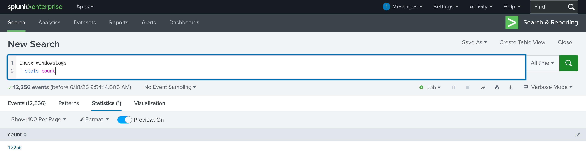

The next step is to summarize common source IP values. This turns raw event volume into a reviewable pattern.

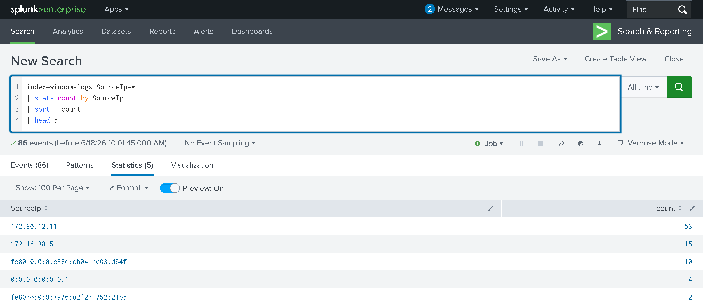

Reviewer takeaway: this shows the start of analyst triage: confirm data exists, then summarize fields that matter.

### 2. Filtering narrows raw logs into investigation sets

Once the dataset is searchable, the analyst narrows the search with field filters and compound conditions.

Filtering by Windows Event ID isolates a specific class of activity.

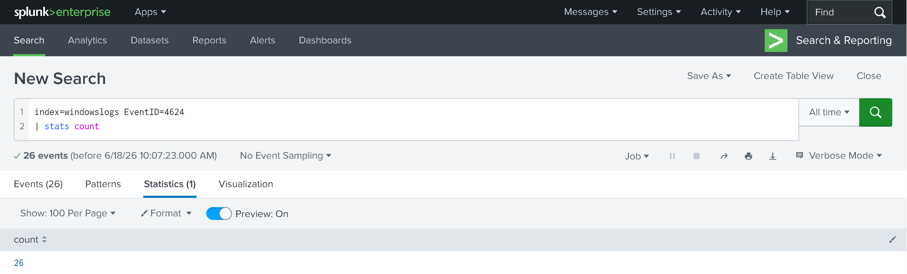

Compound filtering adds destination IP and port constraints.

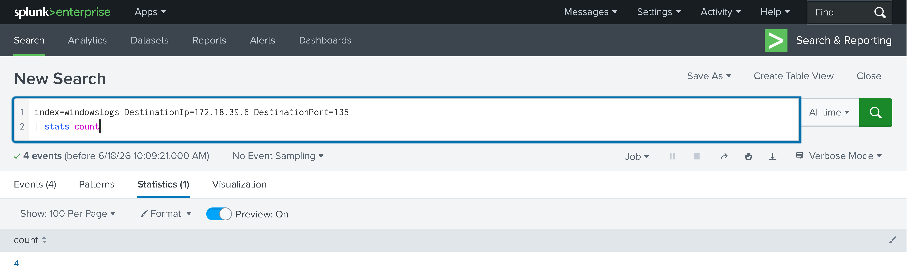

Reviewer takeaway: this shows basic SOC search behavior: reduce noise, isolate relevant event types, and pivot by network fields.

### 3. Fields are shaped into analyst-readable results

Raw event views are difficult to review. SPL becomes more useful when the analyst extracts and organizes the fields needed for a decision.

A regex search identifies a target object pattern related to manager values.

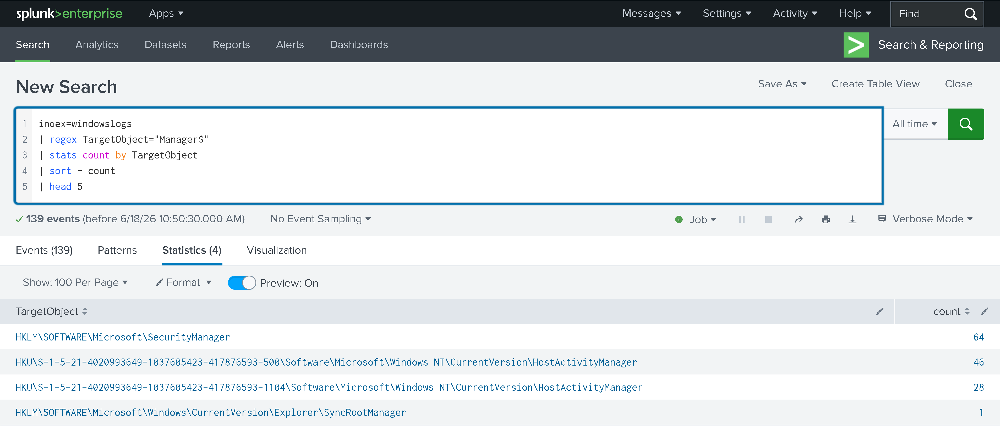

Table output turns selected fields into a clean analyst view.

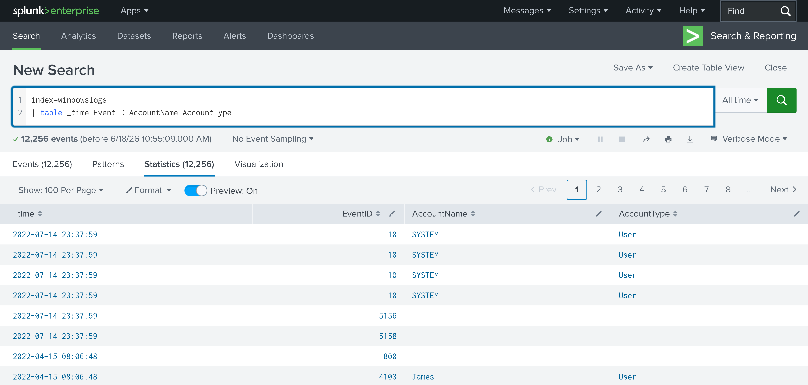

Reviewer takeaway: this shows the transition from raw logs to structured investigation views.

### 4. Process and image activity can be summarized

Analysts often need to identify common processes, suspicious binaries, or unusual execution patterns. This section uses transforming commands to summarize image activity.

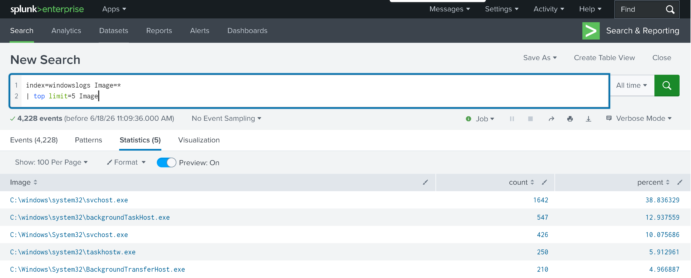

Reviewer takeaway: this shows the use of aggregation commands to quickly identify common executables or process patterns.

### 5. Enrichment adds context to events

SPL becomes more useful when event data is enriched with additional context.

IP geolocation adds region context to source IP activity.

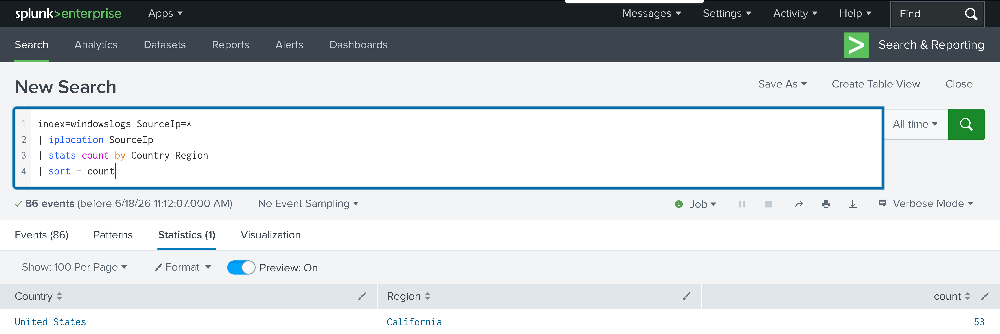

Lookup enrichment adds risk context to image values.

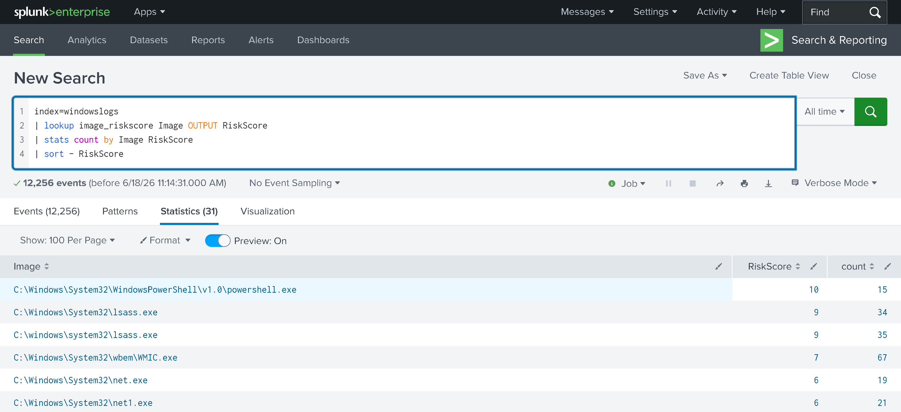

Reviewer takeaway: this shows how SPL can move from raw event search to contextualized triage.

### 6. Baseline logic supports anomaly detection

The final step in this section applies simple baseline logic to VPN activity.

Rare country logic compares VPN login geography against observed user activity.

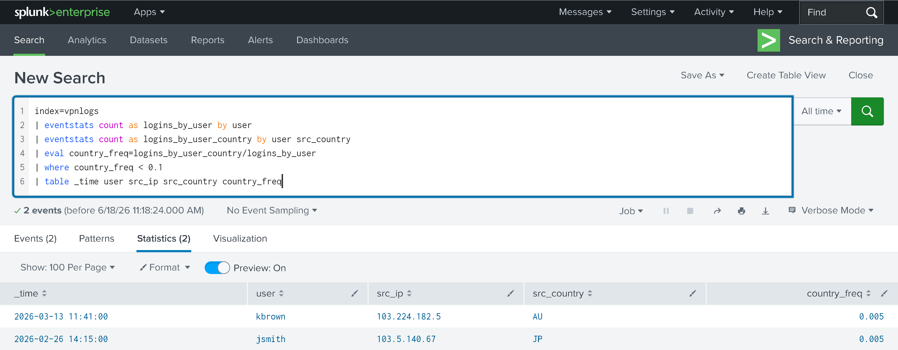

Login-hour z-score logic looks for unusual access timing.

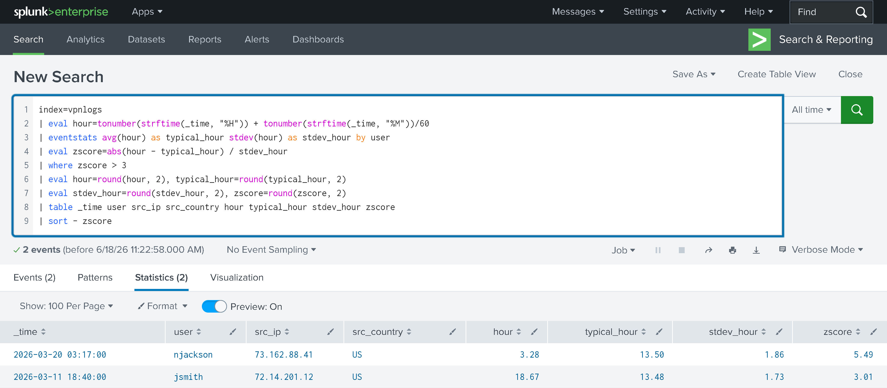

Reviewer takeaway: this shows a practical progression from basic searches into detection-oriented analyst logic.

## Supporting Files

| File | Why it matters |
|---|---|
| [Section 01 SPL](../spl/01-spl-fundamentals.spl) | Contains the SPL searches used for triage, filtering, structuring, enrichment, and anomaly logic. |

## Complete Evidence Reference

The screenshots embedded above are the most important reviewer-facing proof. The complete evidence set is listed below for full traceability.

| Screenshot | What it proves |
|---|---|
| [01 - Base event count](../screenshots/01-splunk-exploring-spl/task-02-search-reporting/01-splunk-windowslogs-base-event-count.png) | Windows log dataset is searchable. |
| [02 - Source IP frequency](../screenshots/01-splunk-exploring-spl/task-02-search-reporting/02-splunk-top-sourceip-frequency-analysis.png) | Source IP activity can be summarized. |
| [03 - Time-bounded count](../screenshots/01-splunk-exploring-spl/task-02-search-reporting/03-splunk-time-bounded-event-count.png) | Searches can be constrained by time. |
| [04 - Event ID 4624 filter](../screenshots/01-splunk-exploring-spl/task-03-search-operators/04-splunk-eventid-4624-equality-filter.png) | Specific Windows event types can be isolated. |
| [05 - Destination IP and port filter](../screenshots/01-splunk-exploring-spl/task-03-search-operators/05-splunk-destinationip-port-compound-filter.png) | Network fields can be combined for focused filtering. |
| [06 - Host, destination, source IP analysis](../screenshots/01-splunk-exploring-spl/task-03-search-operators/06-splunk-host-destination-sourceip-analysis.png) | Host and network pivots can be reviewed together. |
| [07 - Wildcard keyword search](../screenshots/01-splunk-exploring-spl/task-03-search-operators/07-splunk-wildcard-keyword-search-cyber.png) | Keyword and wildcard searching can locate relevant events. |
| [08 - Field selection](../screenshots/01-splunk-exploring-spl/task-04-filtering-results/08-splunk-fields-sourceprocessid-filtering.png) | Search output can be reduced to relevant fields. |
| [09 - Regex target object filter](../screenshots/01-splunk-exploring-spl/task-04-filtering-results/09-splunk-regex-targetobject-manager.png) | Regex can locate structured patterns inside event fields. |
| [10 - Account field table](../screenshots/01-splunk-exploring-spl/task-05-structuring-results/10-splunk-table-account-fields.png) | Results can be shaped into analyst-readable tables. |
| [11 - Reverse account event table](../screenshots/01-splunk-exploring-spl/task-05-structuring-results/11-splunk-reverse-account-event-table.png) | Table ordering can support review flow. |
| [12 - Process timeline](../screenshots/01-splunk-exploring-spl/task-05-structuring-results/12-splunk-process-timeline-a1berto-password-redacted.png) | Process activity can be organized into a timeline. |
| [13 - Image frequency](../screenshots/01-splunk-exploring-spl/task-06-transforming-commands/13-splunk-top-image-frequency-analysis.png) | Transforming commands can summarize process image frequency. |
| [14 - IP geolocation enrichment](../screenshots/01-splunk-exploring-spl/task-06-transforming-commands/14-splunk-iplocation-sourceip-region-enrichment.png) | Source IPs can be enriched with region context. |
| [15 - Risk-score lookup enrichment](../screenshots/01-splunk-exploring-spl/task-06-transforming-commands/15-splunk-lookup-image-riskscore-enrichment.png) | Lookup files can add risk context to events. |
| [16 - Rare VPN country outlier](../screenshots/01-splunk-exploring-spl/task-07-anomaly-detection/16-splunk-vpn-rare-country-outlier-detection.png) | User VPN country activity can be baselined for outlier review. |
| [17 - Login-hour z-score outlier](../screenshots/01-splunk-exploring-spl/task-07-anomaly-detection/17-splunk-vpn-login-hour-zscore-outlier.png) | Login timing can be reviewed with z-score logic. |

## Reviewer Takeaway

This section demonstrates the core SPL investigation loop:

1. Validate searchable data.
2. Filter to relevant event sets.
3. Shape raw events into readable tables.
4. Summarize process and network activity.
5. Enrich events with context.
6. Apply simple baseline logic for anomaly review.

This is the SPL foundation that supports the later ingestion, dashboarding, parsing, and network-log analysis sections.
