# Section 02 - Splunk Lab Deployment and Log Ingestion

[Previous](./01-spl-fundamentals-and-detection-queries.md) | [README](../README.md) | [Proof Map](../reviewer-proof-map.md) | [Docs Index](README.md) | [Next](./03-reports-alerts-and-dashboards.md)

## Purpose

This section documents Splunk deployment and log ingestion validation.

The goal is to show that the analyst can verify Splunk service state, configure receiving, define an index, connect a forwarder, monitor log sources, and prove that Linux authentication logs and Apache access logs are searchable.

## Visual Walkthrough

### 1. Splunk Enterprise is installed and reachable

The workflow starts by validating that Splunk Enterprise exists on the Linux system and that the Splunk web interface is running.

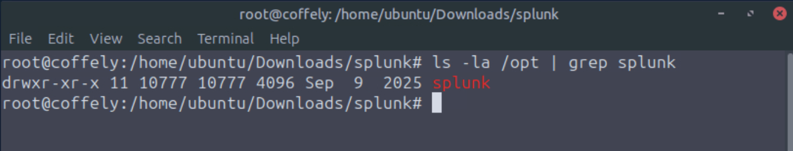

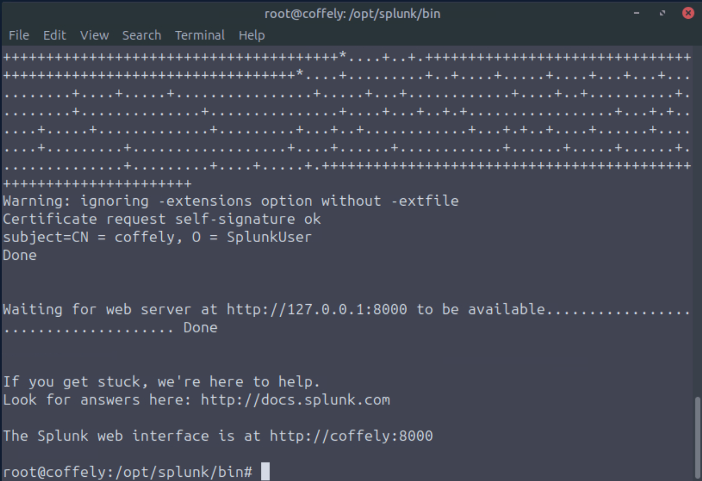

CLI status validation confirms that Splunk is running.

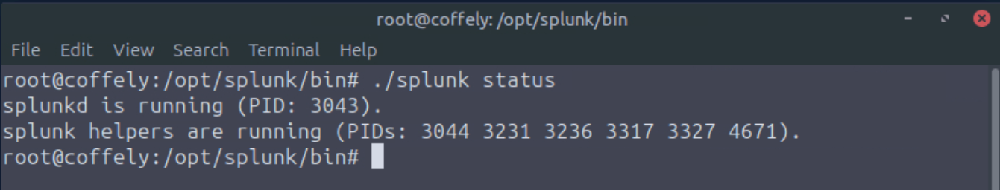

Reviewer takeaway: this proves the Splunk service is present, running, and reachable before ingestion work begins.

### 2. A universal forwarder is installed and running

The universal forwarder is the collection-side component that sends monitored log data to Splunk Enterprise.

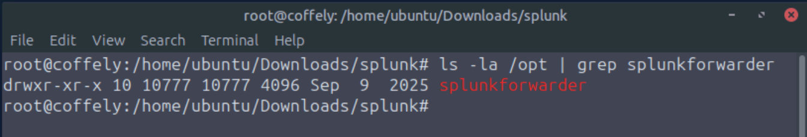

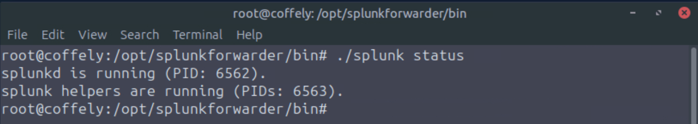

Reviewer takeaway: this shows the forwarder side of the ingestion path, not just search usage in the Splunk UI.

### 3. Splunk receiving and indexing are configured

Splunk must be configured to receive forwarded data. Port `9997` is enabled as the receiving path.

A Linux host index is created to organize the incoming log data.

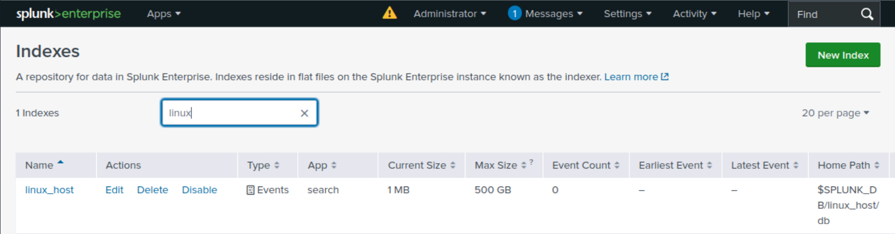

The forwarder is configured to send output to the indexer.

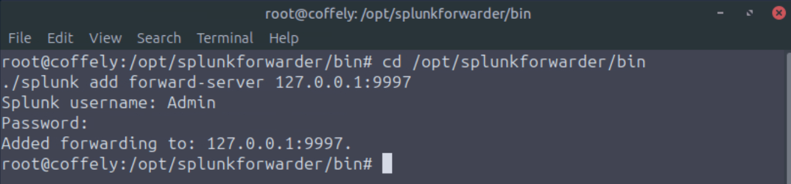

Reviewer takeaway: this shows the ingestion path from forwarder to indexer and confirms that receiving was explicitly configured.

### 4. Linux authentication logs are monitored and validated

The forwarder monitors the Linux authentication log source.

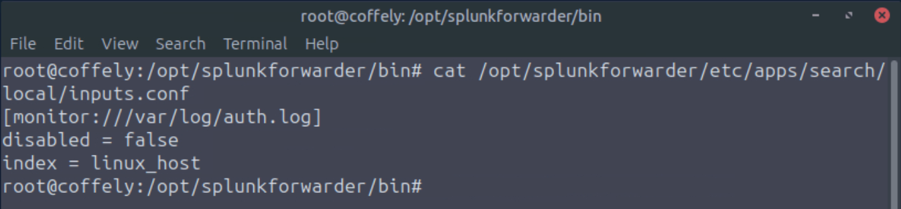

The auth log data is then validated in Splunk search with the expected index, source, sourcetype, and host context.

A user creation event is also validated to prove that relevant authentication activity is searchable.

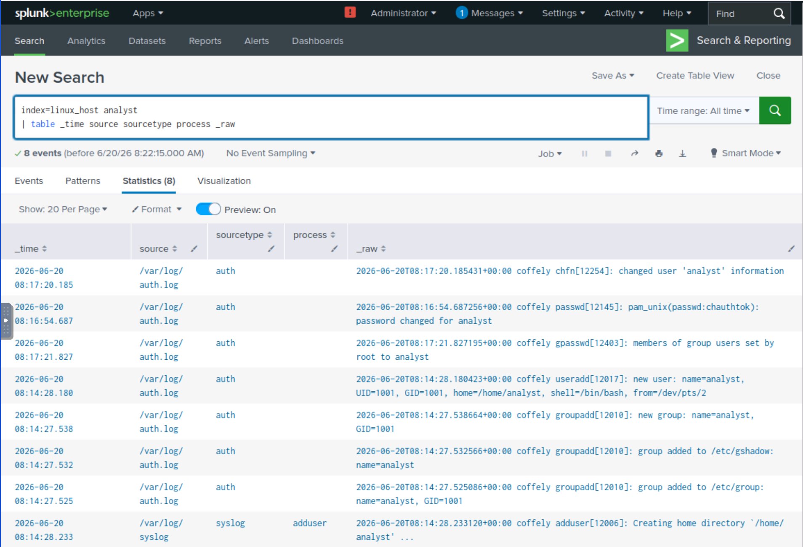

Reviewer takeaway: this shows ingestion validation tied to real security-relevant Linux authentication activity.

### 5. Apache access logs are monitored and validated

The workflow then adds web access logs. The forwarder monitor input is configured for the Apache access log source.

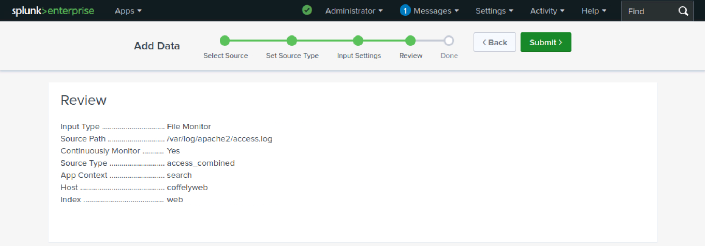

Splunk search validates that Apache access logs are now searchable.

Field frequency review then shows web root activity and URI patterns.

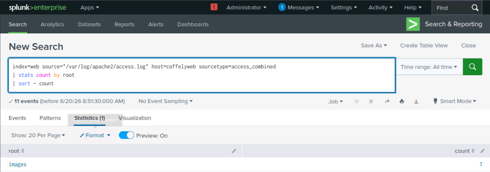

The analyst can also locate specific URI paths in the web data.

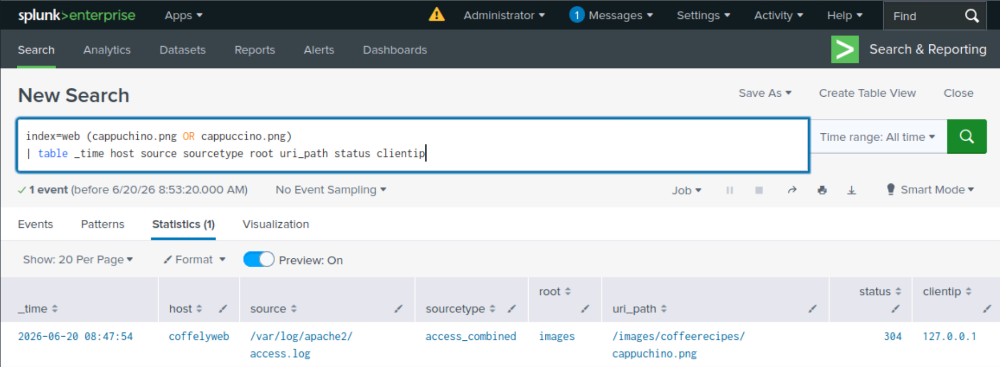

A sensitive-looking web path access is validated without exposing page content.

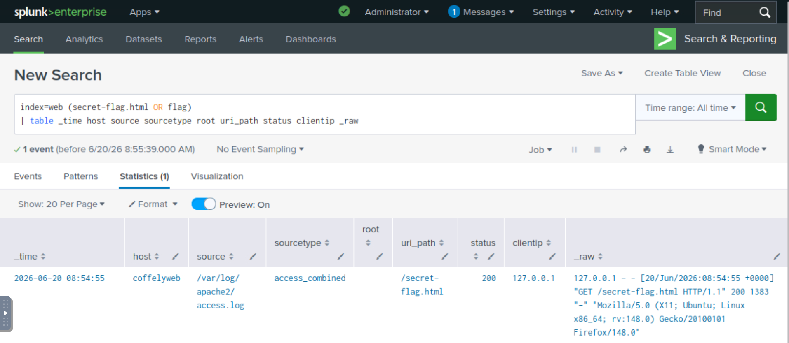

Reviewer takeaway: this shows web log onboarding and analyst validation against URI-level access data.

## Supporting Files

| File | Why it matters |
|---|---|
| [Section 02 SPL validation](../spl/02-ingestion-validation.spl) | Contains the searches used to validate Linux auth log ingestion, Apache access log ingestion, and targeted activity review. |

## Complete Evidence Reference

The screenshots embedded above are the most important reviewer-facing proof. The complete evidence set is listed below for full traceability.

| Screenshot | What it proves |
|---|---|
| [18 - Splunk install directory](../screenshots/02-splunk-setting-up-soc-lab/task-03-linux-deployment/18-splunk-linux-install-directory-opt.png) | Splunk Enterprise files exist on the Linux host. |
| [19 - Splunk web running](../screenshots/02-splunk-setting-up-soc-lab/task-03-linux-deployment/19-splunk-enterprise-running-web-port-8000.png) | Splunk web is reachable on port 8000. |
| [20 - CLI status running](../screenshots/02-splunk-setting-up-soc-lab/task-04-managing-splunk-cli/20-splunk-cli-status-running.png) | Splunk service state is validated from CLI. |
| [21 - Forwarder install directory](../screenshots/02-splunk-setting-up-soc-lab/task-05-universal-forwarder/21-splunk-universal-forwarder-install-directory.png) | Universal Forwarder files exist on the host. |
| [22 - Forwarder running](../screenshots/02-splunk-setting-up-soc-lab/task-05-universal-forwarder/22-splunk-universal-forwarder-running.png) | Universal Forwarder service is running. |
| [23 - Receiving enabled](../screenshots/02-splunk-setting-up-soc-lab/task-06-configuring-forwarder/23-splunk-receiving-port-9997-enabled.png) | Splunk is configured to receive forwarded data. |
| [24 - Linux host index](../screenshots/02-splunk-setting-up-soc-lab/task-06-configuring-forwarder/24-splunk-linux-host-index-created.png) | Dedicated index was created for Linux host data. |
| [25 - Forwarder output](../screenshots/02-splunk-setting-up-soc-lab/task-06-configuring-forwarder/25-splunk-forwarder-output-to-indexer-9997.png) | Forwarder output points to Splunk receiving port. |
| [26 - Auth log monitor input](../screenshots/02-splunk-setting-up-soc-lab/task-06-configuring-forwarder/26-splunk-forwarder-authlog-monitor-inputs.png) | Linux auth log source is monitored. |
| [27 - Auth log validation](../screenshots/02-splunk-setting-up-soc-lab/task-06-configuring-forwarder/27-splunk-authlog-ingestion-sourcetype-validation.png) | Authentication logs are searchable in Splunk. |
| [28 - User creation validation](../screenshots/02-splunk-setting-up-soc-lab/task-06-configuring-forwarder/28-splunk-adduser-analyst-process-validation.png) | Security-relevant Linux activity can be located. |
| [29 - Apache monitor input](../screenshots/02-splunk-setting-up-soc-lab/task-08-ingesting-web-logs/29-splunk-apache-accesslog-monitor-config.png) | Apache access log source is monitored. |
| [30 - Web log validation](../screenshots/02-splunk-setting-up-soc-lab/task-08-ingesting-web-logs/30-splunk-web-accesslog-ingestion-validation.png) | Web logs are searchable in Splunk. |
| [31 - Web root field frequency](../screenshots/02-splunk-setting-up-soc-lab/task-08-ingesting-web-logs/31-splunk-web-root-field-frequency-analysis.png) | Web activity can be summarized by field frequency. |
| [32 - Specific URI path](../screenshots/02-splunk-setting-up-soc-lab/task-08-ingesting-web-logs/32-splunk-web-cappuchino-uri-path.png) | Specific web URI activity can be located. |
| [33 - Sensitive-looking web path](../screenshots/02-splunk-setting-up-soc-lab/task-08-ingesting-web-logs/33-splunk-web-secret-flag-access-validation.png) | Sensitive-looking web path access can be validated. |

## Reviewer Takeaway

This section demonstrates the ingestion foundation required before Splunk analysis is meaningful.

The completed workflow demonstrates a practical SOC skill chain:

1. Validate Splunk Enterprise service state.
2. Validate universal forwarder installation and service state.
3. Enable receiving on the indexer.
4. Create and use a target index.
5. Monitor Linux authentication logs.
6. Monitor Apache access logs.
7. Validate searchable security and web activity.
