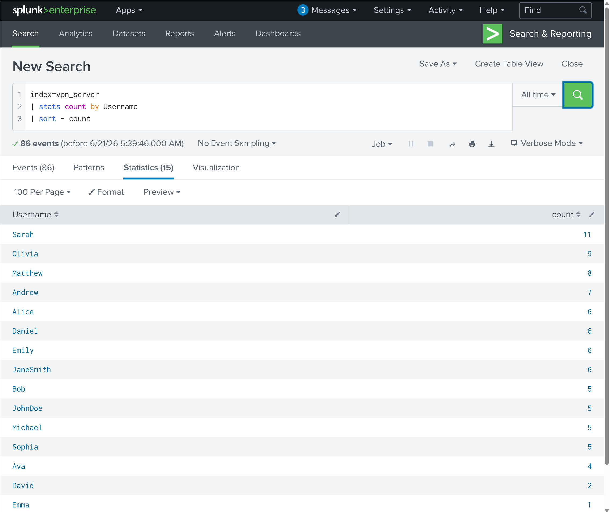
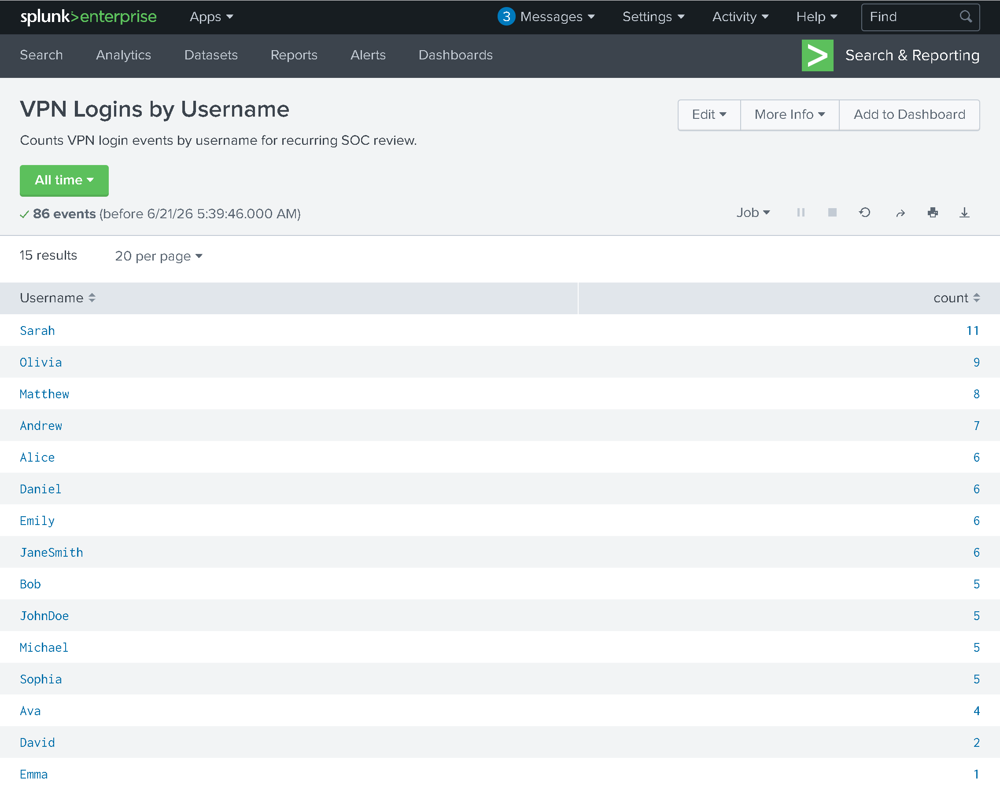
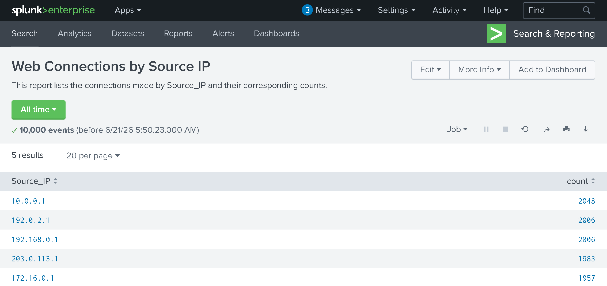
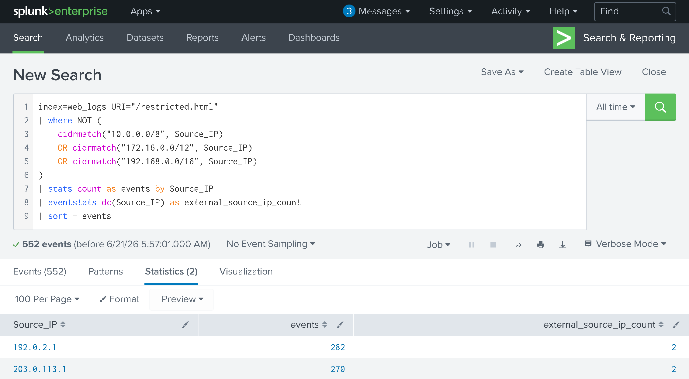
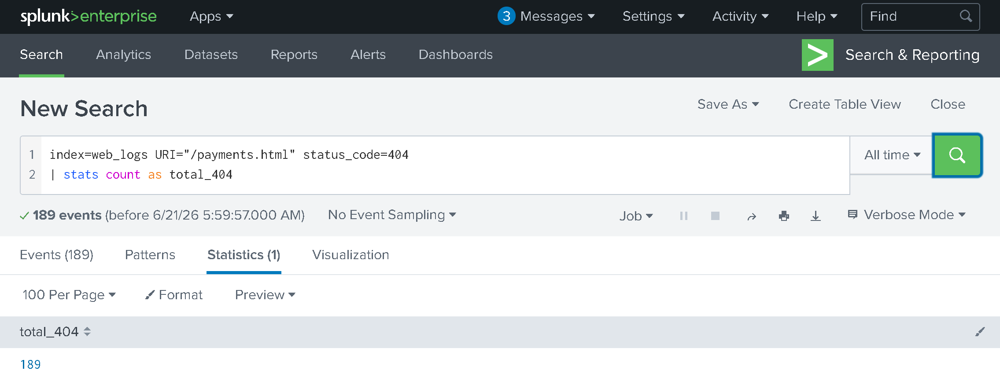
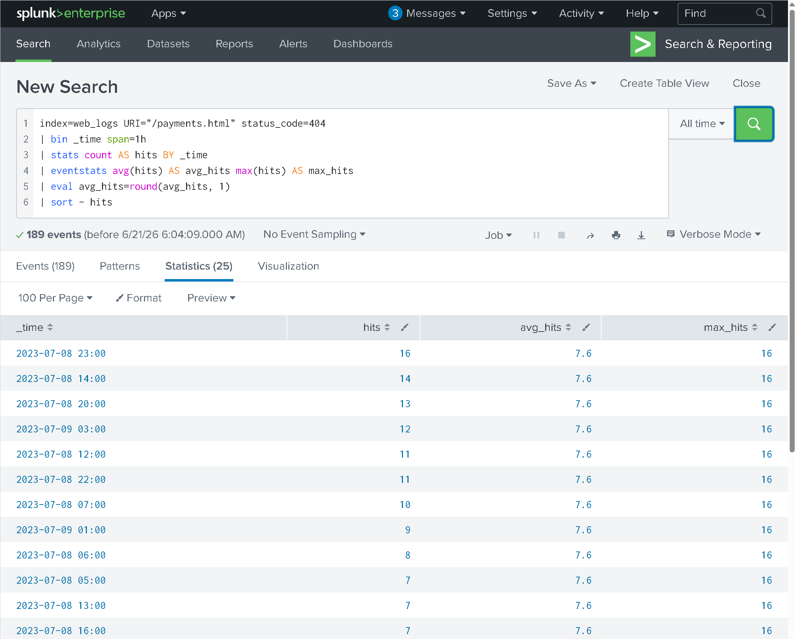
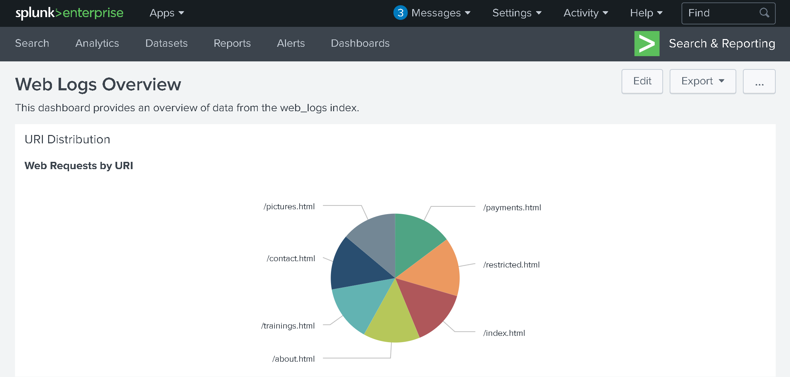
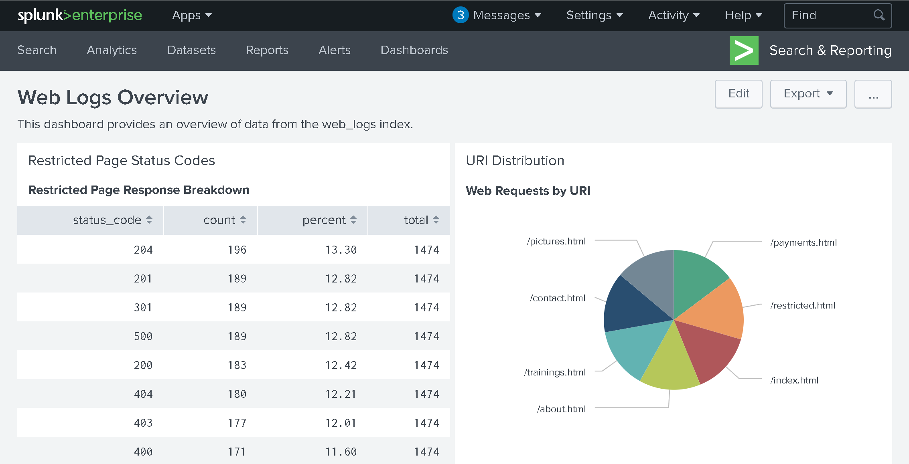
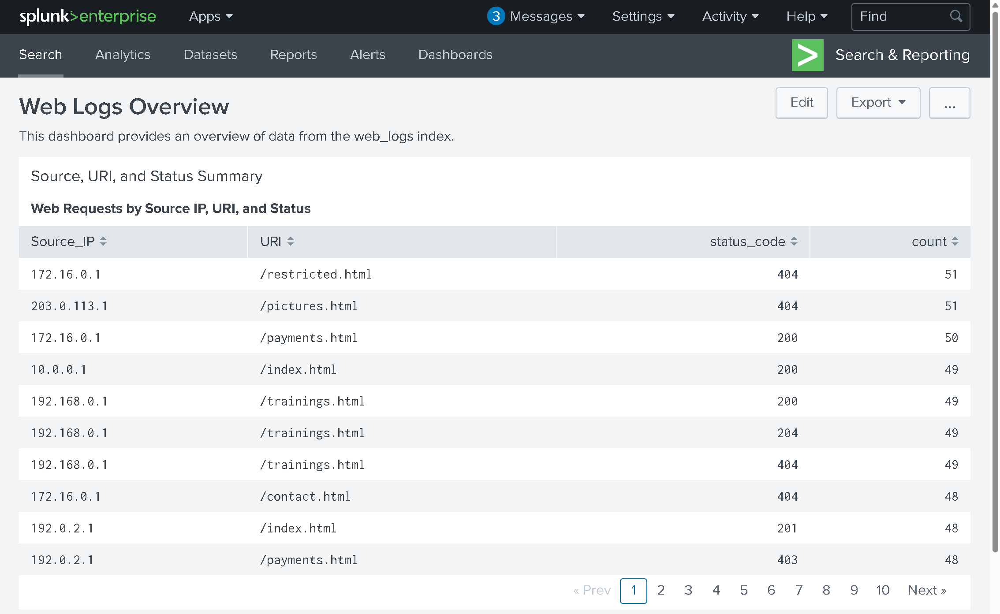

# Section 03 - Reports, Alerts, and Dashboards

[Previous](./02-splunk-lab-deployment-and-log-ingestion.md) | [README](../README.md) | [Proof Map](../reviewer-proof-map.md) | [Docs Index](README.md) | [Next](./04-data-parsing-normalization-and-field-extraction.md)

## Purpose

This section documents how recurring Splunk searches can become reusable analyst assets.

The goal is to show the progression from one-time searches into reports, alert-candidate logic, and dashboard panels that support repeatable SOC review.

## Visual Walkthrough

### 1. VPN activity becomes a reusable report

The workflow starts by turning VPN login activity into a report-oriented search.

The report view makes the result reusable instead of leaving it as a one-time investigation query.

Reviewer takeaway: this shows how recurring access-review questions can be turned into saved reporting views.

### 2. Web activity is summarized for recurring review

Web connections are summarized by source IP so repeated access patterns can be reviewed quickly.

Reviewer takeaway: this shows report creation for web activity, not just raw search inspection.

### 3. Alert-candidate logic focuses on restricted access

The workbook documents alert-candidate SPL for external access to a restricted page. This is framed as detection logic that could support alerting without overstating production alert deployment.

Reviewer takeaway: this shows detection thinking: define the condition, constrain the event set, and produce a reviewable signal.

### 4. Error activity is counted and thresholded

The workflow also reviews HTTP 404 activity. First, total 404 activity is counted.

Then hourly 404 activity is shaped into threshold-style alert-candidate logic.

Reviewer takeaway: this shows how an analyst can move from counting error activity to shaping logic for recurring threshold review.

### 5. Dashboard panels turn searches into review surfaces

Dashboards help convert repeated search patterns into a visual surface for recurring analyst review.

A URI pie chart panel summarizes web request distribution.

A restricted status-code table gives a focused view of restricted-path response behavior.

A source IP, URI, and status-code table supports repeated review of web access activity.

Reviewer takeaway: this shows that the analyst can turn SPL into dashboard views that are easier for reviewers and operators to consume.

## Supporting Files

| File | Why it matters |
|---|---|
| [Section 03 SPL](../spl/03-reports-alerts-dashboards.spl) | Contains the report searches, alert-candidate searches, and dashboard panel searches used in this section. |

## Complete Evidence Reference

The screenshots embedded above are the most important reviewer-facing proof. The complete evidence set is listed below for full traceability.

| Screenshot | What it proves |
|---|---|
| [34 - VPN report search](../screenshots/03-splunk-dashboards-and-reports/task-02-reports/34-splunk-vpn-logins-by-username-report-search.png) | VPN login activity can be summarized by username. |
| [35 - VPN report view](../screenshots/03-splunk-dashboards-and-reports/task-02-reports/35-splunk-vpn-logins-by-username-report-view.png) | VPN login search was converted into a report view. |
| [36 - Web connections report](../screenshots/03-splunk-dashboards-and-reports/task-02-reports/36-splunk-web-connections-by-source-ip-report.png) | Web connections can be summarized by source IP. |
| [37 - Restricted page detection](../screenshots/03-splunk-dashboards-and-reports/task-03-alerts/37-splunk-alert-restricted-page-external-sourceip-detection.png) | Restricted page access can be shaped into alert-candidate logic. |
| [38 - 404 total count](../screenshots/03-splunk-dashboards-and-reports/task-03-alerts/38-splunk-payments-404-total-count.png) | HTTP 404 activity can be counted. |
| [39 - 404 hourly threshold](../screenshots/03-splunk-dashboards-and-reports/task-03-alerts/39-splunk-payments-404-hourly-threshold-rule.png) | 404 activity can be shaped into threshold-style review logic. |
| [40 - URI pie chart panel](../screenshots/03-splunk-dashboards-and-reports/task-04-dashboards/40-splunk-dashboard-uri-pie-chart-panel.png) | URI activity can be visualized in a dashboard panel. |
| [41 - Restricted status table](../screenshots/03-splunk-dashboards-and-reports/task-04-dashboards/41-splunk-dashboard-restricted-status-code-table.png) | Restricted-path status behavior can be reviewed in a dashboard table. |
| [42 - Source IP URI status table](../screenshots/03-splunk-dashboards-and-reports/task-04-dashboards/42-splunk-dashboard-sourceip-uri-statuscode-table.png) | Source IP, URI, and status-code activity can be reviewed together. |

## Reviewer Takeaway

This section demonstrates how SPL work becomes reusable analyst infrastructure.

The completed workflow demonstrates a practical SOC skill chain:

1. Convert repeated searches into reports.
2. Shape detection conditions into alert-candidate SPL.
3. Count and threshold error activity.
4. Build dashboard panels for recurring review.
5. Make investigation results easier for reviewers and operators to consume.
