# Section 04 - Splunk Data Parsing, Normalization, and Field Extraction

[Previous](./03-reports-alerts-and-dashboards.md) | [README](../README.md) | [Proof Map](../reviewer-proof-map.md) | [Docs Index](README.md) | [Next](./05-applied-parsing-fix-and-network-log-analysis.md)

## Purpose

This section documents Splunk data manipulation work that turns poorly structured scripted-input data into searchable, analyst-ready events.

The main proof is not only that searches were run. The stronger proof is that broken or messy data was diagnosed, repaired through Splunk configuration, validated in search, and documented as repeatable analyst workflow.

## Visual Walkthrough

### 1. App-scoped inputs create controlled data sources

The workflow begins by creating a Splunk app structure and defining scripted inputs. This keeps ingestion configuration scoped, repeatable, and easier to review.

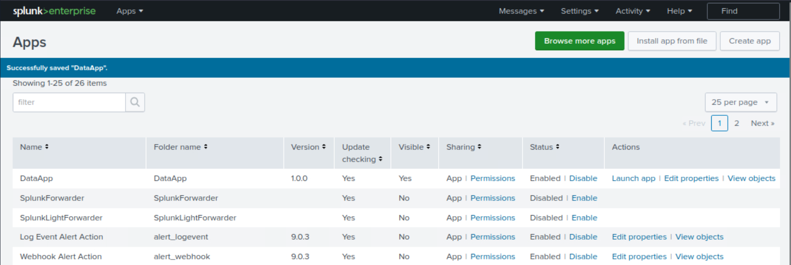

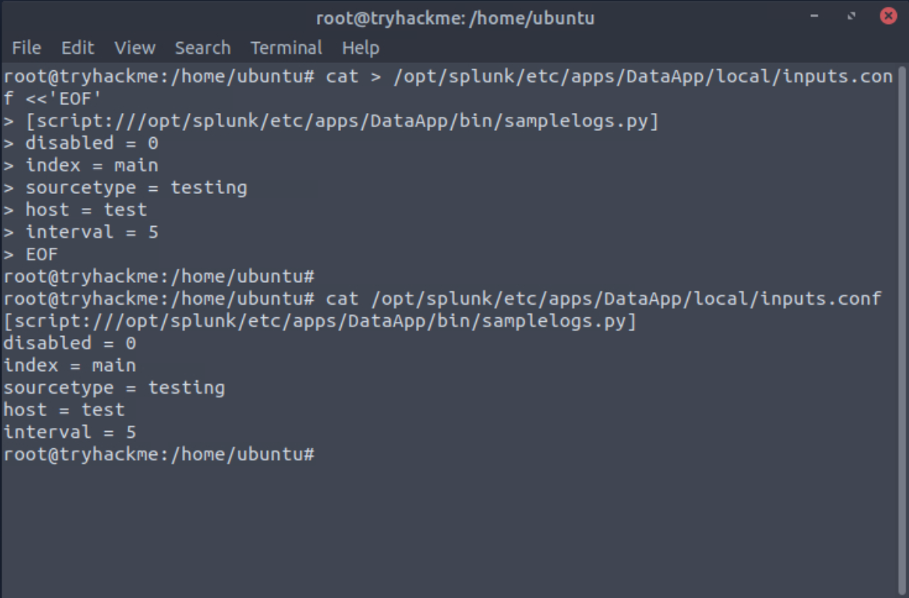

The initial validation proves that the scripted input is producing searchable events in Splunk.

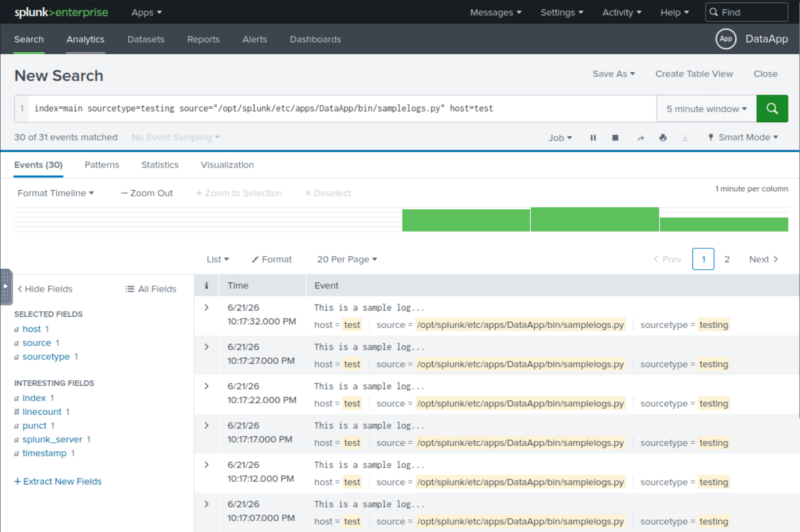

Reviewer takeaway: this establishes basic Splunk app and input configuration literacy before moving into parsing repair.

### 2. Broken VPN event boundaries are diagnosed and repaired

The VPN log source initially produces poorly separated events. This is the kind of problem that makes searches unreliable because one logical event may be merged with another or split incorrectly.

The repair is applied in `props.conf` using event-boundary configuration.

The corrected parsing is then validated in search.

Reviewer takeaway: this shows the ability to recognize bad event structure, repair it with Splunk configuration, and validate the result.

### 3. Multiline authentication events are normalized

Authentication logs can span multiple lines. If Splunk breaks them incorrectly, analyst searches lose context. This section shows the broken multiline behavior and the corrected result.

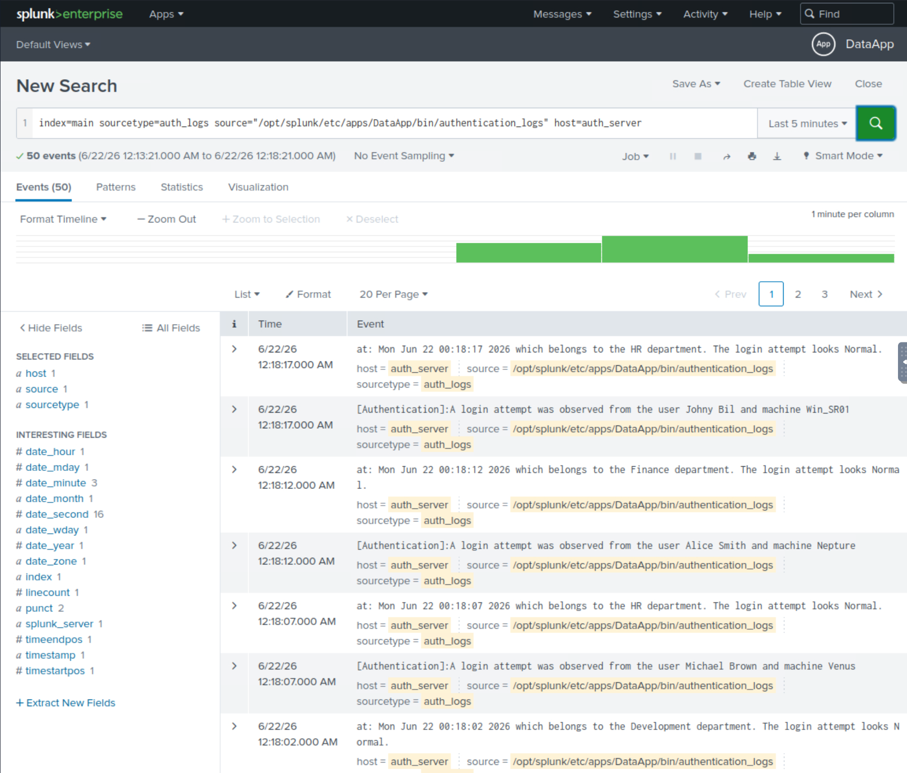

The multiline rule is configured in `props.conf`.

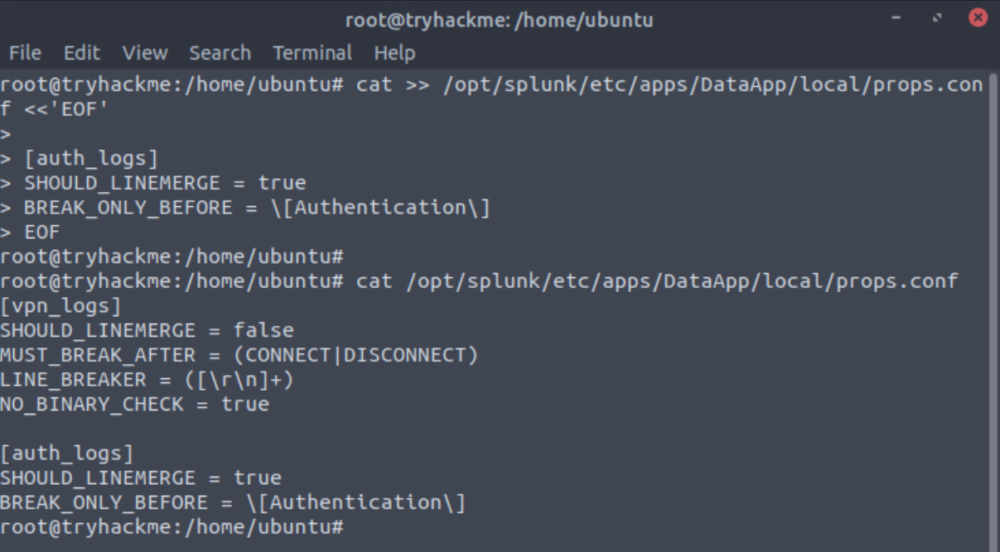

The repaired authentication event structure is validated in Splunk.

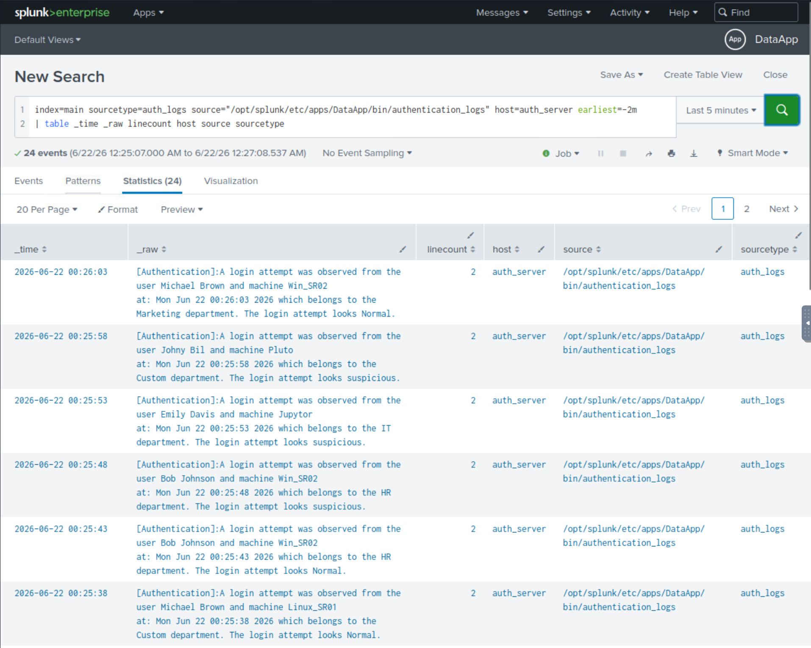

Reviewer takeaway: this shows parsing logic beyond simple one-line event ingestion.

### 4. Sensitive-looking purchase data is masked

The purchase log workflow shows publication-safe handling of credit-card-like values. The point is to prove masking and validation without exposing sensitive values in public evidence.

The masking rule is configured with `SEDCMD`.

The masked output is validated in search.

Reviewer takeaway: this shows public-safe evidence handling and Splunk masking mechanics.

### 5. Custom analyst fields are extracted and validated

After event structure is repaired, fields are extracted so analysts can search and aggregate by meaningful values instead of raw text.

VPN custom fields are defined in `transforms.conf`.

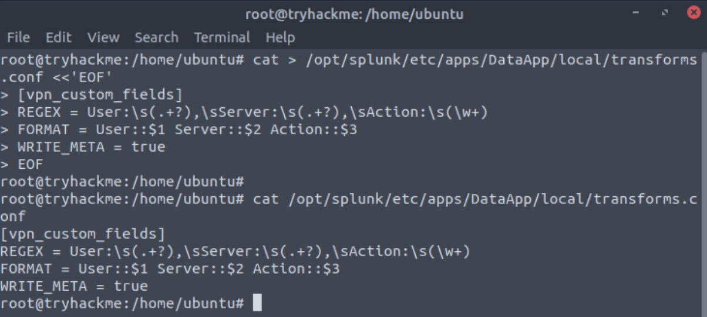

The transform is attached to the sourcetype in `props.conf`.

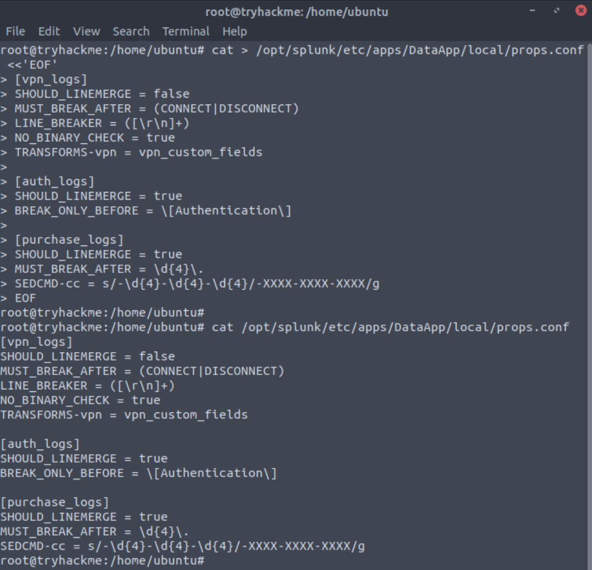

The extracted VPN fields are validated in Splunk.

The purchase log workflow then repeats the same pattern for purchase-specific fields.

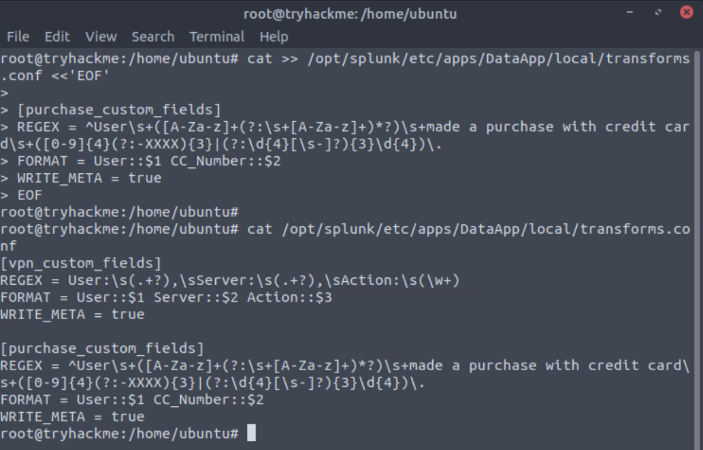

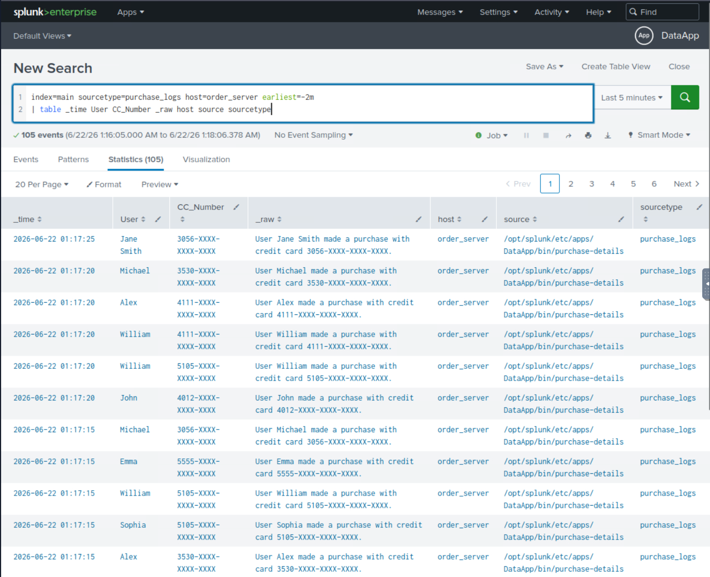

The final summary confirms that extracted fields can support aggregation.

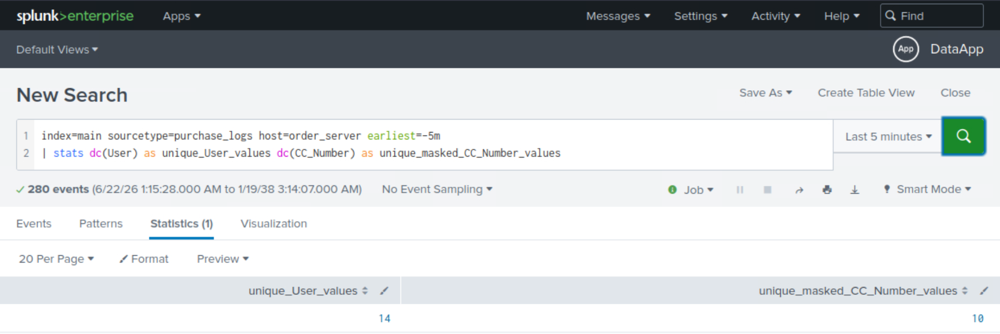

Reviewer takeaway: this shows the full loop: raw scripted input, broken parsing, configuration repair, field extraction, and searchable validation.

## Supporting Files

| File | Why it matters |
|---|---|
| [DataApp inputs.conf](../configs/dataapp/inputs.conf) | Defines scripted inputs for the lab data sources. |
| [DataApp props.conf](../configs/dataapp/props.conf) | Defines event boundaries, multiline handling, masking, and transform attachment. |
| [DataApp transforms.conf](../configs/dataapp/transforms.conf) | Defines custom field extraction regex and field mappings. |
| [DataApp fields.conf](../configs/dataapp/fields.conf) | Registers extracted fields for indexed field behavior. |
| [Section 04 SPL validation](../spl/04-data-manipulation-validation.spl) | Contains the searches used to validate parsing, masking, and field extraction. |

## Complete Evidence Reference

The screenshots embedded above are the most important reviewer-facing proof. The complete evidence set is listed below for full traceability.

| Screenshot | What it proves |
|---|---|
| [43 - DataApp created](../screenshots/04-splunk-data-manipulation/task-05-splunk-app/43-splunk-dataapp-created-in-manage-apps.png) | Splunk app was created for scoped configuration. |
| [44 - DataApp directory structure](../screenshots/04-splunk-data-manipulation/task-05-splunk-app/44-splunk-dataapp-directory-structure.png) | App folder structure exists for configuration files. |
| [45 - inputs.conf scripted input](../screenshots/04-splunk-data-manipulation/task-05-splunk-app/45-splunk-dataapp-inputs-conf-scripted-input.png) | Scripted input configuration is present. |
| [46 - Scripted input validation](../screenshots/04-splunk-data-manipulation/task-05-splunk-app/46-splunk-dataapp-scripted-input-ingestion-validation.png) | DataApp scripted input produces searchable events. |
| [47 - VPN scripted input](../screenshots/04-splunk-data-manipulation/task-06-event-boundaries/47-splunk-vpnlogs-scripted-input-config.png) | VPN log source is configured. |
| [48 - Broken VPN boundaries](../screenshots/04-splunk-data-manipulation/task-06-event-boundaries/48-splunk-vpnlogs-broken-event-boundaries-before-fix.png) | VPN events are broken before parsing repair. |
| [49 - VPN boundary rule](../screenshots/04-splunk-data-manipulation/task-06-event-boundaries/49-splunk-vpnlogs-props-conf-event-boundary-rule.png) | Event-boundary rule is configured. |
| [50 - VPN boundary validation](../screenshots/04-splunk-data-manipulation/task-06-event-boundaries/50-splunk-vpnlogs-fixed-event-boundary-validation.png) | VPN events are fixed and searchable. |
| [51 - Auth scripted input](../screenshots/04-splunk-data-manipulation/task-07-multiline-events/51-splunk-authlogs-scripted-input-config.png) | Authentication log source is configured. |
| [52 - Broken auth multiline](../screenshots/04-splunk-data-manipulation/task-07-multiline-events/52-splunk-authlogs-broken-multiline-before-fix.png) | Multiline auth events are broken before repair. |
| [53 - Auth multiline rule](../screenshots/04-splunk-data-manipulation/task-07-multiline-events/53-splunk-authlogs-props-conf-multiline-rule.png) | Multiline parsing rule is configured. |
| [54 - Auth multiline validation](../screenshots/04-splunk-data-manipulation/task-07-multiline-events/54-splunk-authlogs-fixed-multiline-validation.png) | Multiline auth events are fixed and searchable. |
| [55 - Purchase scripted input](../screenshots/04-splunk-data-manipulation/task-08-masking-sensitive-data/55-splunk-purchaselogs-scripted-input-config.png) | Purchase log source is configured. |
| [56 - Purchase boundary rule](../screenshots/04-splunk-data-manipulation/task-08-masking-sensitive-data/56-splunk-purchaselogs-props-conf-boundary-rule.png) | Purchase event boundary handling is configured. |
| [57 - SEDCMD masking rule](../screenshots/04-splunk-data-manipulation/task-08-masking-sensitive-data/57-splunk-purchaselogs-props-conf-sedcmd-masking-rule.png) | Sensitive-looking values are masked. |
| [58 - Masked validation](../screenshots/04-splunk-data-manipulation/task-08-masking-sensitive-data/58-splunk-purchaselogs-masked-validation.png) | Masked output is validated in search. |
| [59 - VPN transforms.conf](../screenshots/04-splunk-data-manipulation/task-09-custom-field-extraction/59-splunk-vpn-custom-fields-transforms-conf.png) | VPN field extraction transform is configured. |
| [60 - VPN props transform reference](../screenshots/04-splunk-data-manipulation/task-09-custom-field-extraction/60-splunk-vpn-props-conf-transforms-reference.png) | VPN transform is attached to sourcetype. |
| [61 - VPN fields.conf](../screenshots/04-splunk-data-manipulation/task-09-custom-field-extraction/61-splunk-vpn-custom-fields-fields-conf.png) | VPN extracted fields are registered. |
| [62 - VPN extraction validation](../screenshots/04-splunk-data-manipulation/task-09-custom-field-extraction/62-splunk-vpn-custom-field-extraction-validation.png) | VPN fields are searchable and validated. |
| [63 - Purchase transforms.conf](../screenshots/04-splunk-data-manipulation/task-09-custom-field-extraction/63-splunk-purchase-custom-fields-transforms-conf.png) | Purchase field extraction transform is configured. |
| [64 - Purchase props transform reference](../screenshots/04-splunk-data-manipulation/task-09-custom-field-extraction/64-splunk-purchase-props-conf-transforms-reference.png) | Purchase transform is attached to sourcetype. |
| [65 - Purchase fields.conf](../screenshots/04-splunk-data-manipulation/task-09-custom-field-extraction/65-splunk-purchase-fields-conf-cc-number.png) | Purchase extracted fields are registered. |
| [66 - Purchase extraction validation](../screenshots/04-splunk-data-manipulation/task-09-custom-field-extraction/66-splunk-purchase-custom-field-extraction-validation.png) | Purchase fields are searchable and validated. |
| [67 - Purchase summary counts](../screenshots/04-splunk-data-manipulation/task-09-custom-field-extraction/67-splunk-purchase-field-extraction-summary-counts.png) | Extracted fields support aggregation and review. |

## Reviewer Takeaway

This section is the strongest Splunk configuration proof in the workbook. It shows that the analyst can move beyond searches into parsing repair, data masking, custom field extraction, and validation.

The completed workflow demonstrates a practical SOC skill chain:

1. Identify malformed events.
2. Repair event boundaries and multiline behavior.
3. Mask sensitive-looking values before evidence publication.
4. Extract fields using Splunk configuration.
5. Validate the repaired data with SPL.
