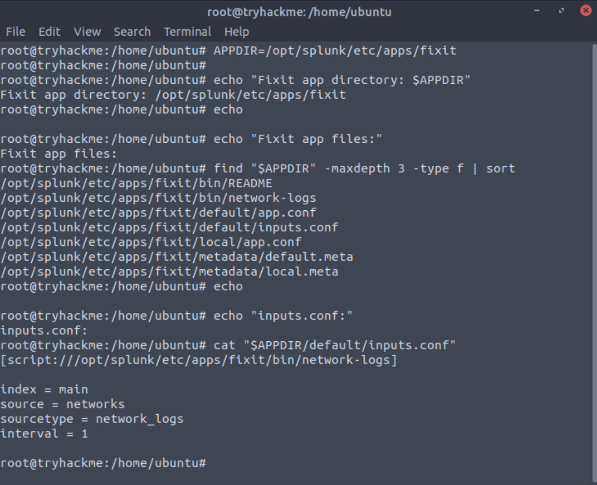
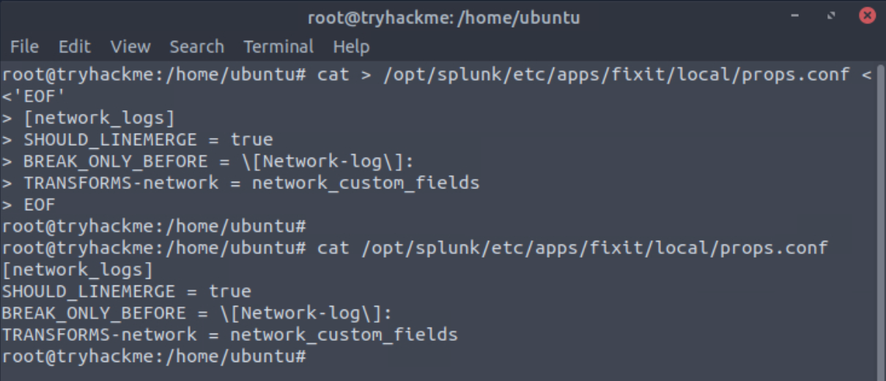
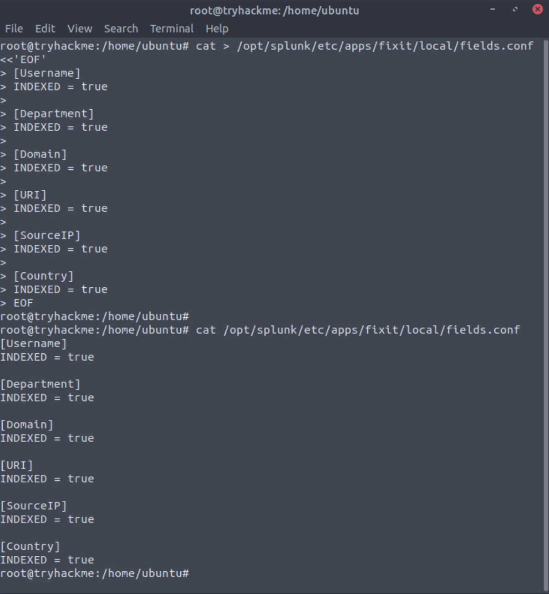

# Section 05 - Applied Parsing Fix and Network Log Analysis

[Previous](./04-data-parsing-normalization-and-field-extraction.md) | [README](../README.md) | [Proof Map](../reviewer-proof-map.md) | [Docs Index](README.md) | Next

## Purpose

This section applies the Splunk parsing workflow to broken network-log data. The goal is to turn poorly structured raw events into analyst-ready fields that support investigation questions.

The main proof is the full chain: identify broken events, repair event boundaries, extract fields, register fields, validate searchability, and use the corrected data for network activity analysis.

## Visual Walkthrough

### 1. Broken network events are identified

The workflow starts with network events that are not properly separated or fielded. In this state, the data is difficult to investigate because important values are trapped in raw text.

Reviewer takeaway: this shows the starting problem. The analyst cannot trust downstream searches until event structure is repaired.

### 2. The scripted input is reviewed

The network log source is defined through an app-scoped scripted input. This establishes where the data is coming from and how Splunk is ingesting it.

Reviewer takeaway: this shows the ingestion path before the parsing repair is applied.

### 3. Event boundaries are repaired in props.conf

The parsing repair begins with event-boundary logic. This tells Splunk where each network event should begin so the raw log stream becomes searchable event records.

Reviewer takeaway: this demonstrates Splunk parsing configuration, not just SPL search usage.

### 4. Custom fields are extracted from the network logs

After event boundaries are corrected, the next step is extracting useful analyst fields from the raw event text.

The custom field extraction maps user, department, domain, URI, source IP, and country values.

The transform is connected to the network log sourcetype in `props.conf`.

The extracted fields are registered in `fields.conf`.

Reviewer takeaway: this shows the complete field-extraction configuration path: define transform, attach transform, register fields.

### 5. The repaired fields are validated in Splunk

The corrected field extraction is validated directly in Splunk search. This proves the parsing repair worked and that the extracted fields are usable for analyst investigation.

Reviewer takeaway: this is the validation point. The data has moved from raw text to searchable fields.

### 6. The corrected data supports network analysis

The final result is a structured analysis summary using the repaired network-log fields. This turns the parsing work into investigation output.

Reviewer takeaway: this shows the operational value of the parsing repair. The fixed data can now answer investigation questions about users, domains, URIs, source IP ranges, and sensitive-looking document access.

## Supporting Files

| File | Why it matters |
|---|---|
| [Fixit inputs.conf](../configs/fixit/inputs.conf) | Defines the scripted input for the network log source. |
| [Fixit props.conf](../configs/fixit/props.conf) | Defines event-boundary repair and transform attachment. |
| [Fixit transforms.conf](../configs/fixit/transforms.conf) | Defines field extraction for network-log values. |
| [Fixit fields.conf](../configs/fixit/fields.conf) | Registers extracted fields for indexed field behavior. |
| [Section 05 SPL analysis](../spl/05-fixit-analysis.spl) | Contains the validation and final network-analysis searches. |

## Complete Evidence Reference

The screenshots embedded above are the most important reviewer-facing proof. The complete evidence set is listed below for full traceability.

| Screenshot | What it proves |
|---|---|
| [68 - Initial broken events](../screenshots/05-splunk-fixit-challenge/task-02-fixit-challenge/68-splunk-fixit-initial-broken-events.png) | Network events were malformed before parsing repair. |
| [69 - Network log scripted input](../screenshots/05-splunk-fixit-challenge/task-02-fixit-challenge/69-splunk-fixit-app-inputs-conf-network-logs.png) | Scripted input was configured for the network log source. |
| [70 - Event boundary fix](../screenshots/05-splunk-fixit-challenge/task-02-fixit-challenge/70-splunk-fixit-props-conf-event-boundary-fix.png) | Event-boundary repair was configured in props.conf. |
| [71 - Custom fields transform](../screenshots/05-splunk-fixit-challenge/task-02-fixit-challenge/71-splunk-fixit-transforms-conf-custom-fields.png) | Network-log field extraction was defined in transforms.conf. |
| [72 - Props transform reference](../screenshots/05-splunk-fixit-challenge/task-02-fixit-challenge/72-splunk-fixit-props-conf-transforms-reference.png) | The transform was attached to the network log sourcetype. |
| [73 - Indexed field registration](../screenshots/05-splunk-fixit-challenge/task-02-fixit-challenge/73-splunk-fixit-fields-conf-indexed-fields.png) | Extracted fields were registered in fields.conf. |
| [74 - Field extraction validation](../screenshots/05-splunk-fixit-challenge/task-02-fixit-challenge/74-splunk-fixit-fixed-field-extraction-validation.png) | Corrected fields were validated in Splunk search. |
| [75 - Network analysis summary](../screenshots/05-splunk-fixit-challenge/task-02-fixit-challenge/75-splunk-fixit-network-analysis-summary.png) | Repaired fields supported final network-log analysis. |

## Validated Analysis Results

The repaired network-log data supported the following investigation outputs:

| Result | Value |
|---|---|
| Domain identified | Cybertees.THM |
| Username values | 28 |
| URI values | 12 |
| Individual product pages | 2 |
| URI without file extension | /sales/ |
| Most active user | Robert Wilson |
| Unique private IP ranges | 3 |
| Sensitive-looking document access user | Sarah Hall |

## Reviewer Takeaway

This section shows applied Splunk repair work under investigation conditions. The analyst starts with broken network logs, fixes parsing, extracts fields, validates the fields, and then uses those fields to produce a structured network analysis.

The completed workflow demonstrates a practical SOC skill chain:

1. Diagnose broken event structure.
2. Repair parsing in Splunk configuration.
3. Extract analyst-useful fields.
4. Validate fields with SPL.
5. Use corrected data for investigation output.
